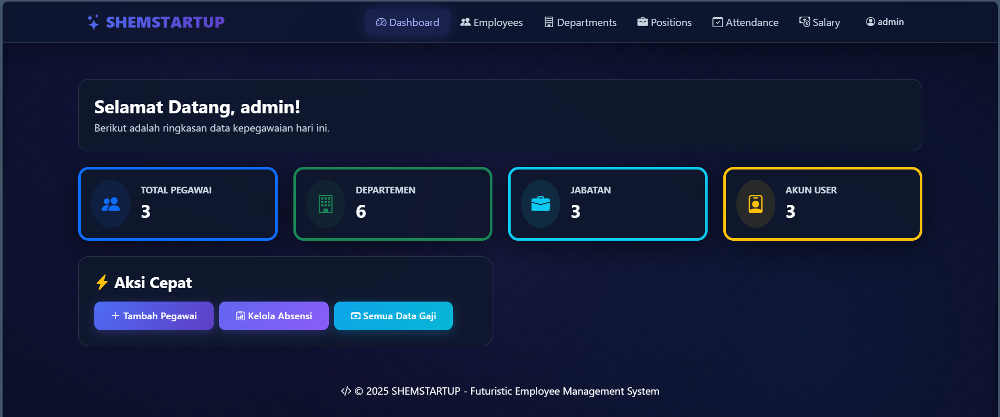

# SHEMSTARTUP - Aplikasi Manajemen Pegawai

Sebuah sistem manajemen karyawan (Employee Management System) yang futuristik dan modern, dibangun menggunakan Laravel 12. Aplikasi ini dirancang untuk mengelola data inti sumber daya manusia dalam sebuah perusahaan, mulai dari data karyawan, absensi, penggajian, hingga manajemen hak akses pengguna.



## 🚀 Fitur Utama

Aplikasi ini mencakup modul-modul penting untuk manajemen HR, dengan tambahan fitur keamanan dan *role* terbaru:

* **Sistem Multi-User & Role (RBAC):** Pemisahan hak akses yang tegas antara **Admin** (akses penuh ke pengaturan & data) dan **Employee** (akses terbatas sesuai peran).
* **Otentikasi Lengkap:** Dilengkapi fitur Login, Register, Reset Password, dan Verifikasi Email menggunakan Laravel Breeze.
* **Manajemen Karyawan:** Mengelola (CRUD) data karyawan, termasuk informasi pribadi, email, nomor telepon, alamat, tanggal masuk, dan status.
* **Manajemen Departemen:** Mengelola daftar departemen yang ada di perusahaan.
* **Manajemen Jabatan:** Mengelola daftar jabatan, termasuk penetapan `gaji_pokok` (gaji dasar) untuk setiap jabatan.
* **Manajemen Absensi:** Mencatat absensi harian karyawan, termasuk `waktu_masuk`, `waktu_keluar`, dan `status_absensi` (hadir, izin, sakit, alpha).
* **Manajemen Gaji:** Menghitung gaji bulanan karyawan berdasarkan gaji pokok, `tunjangan`, dan `potongan`.
* **Slip Gaji Sederhana:** Menampilkan rincian slip gaji (*take home pay*) untuk setiap karyawan per bulan.
* **Tampilan Futuristik:** Menggunakan layout master dengan tema *space* / futuristik gelap.

## 🛠️ Tumpukan Teknologi (Tech Stack)

* **Backend:** Laravel 12.x
* **Frontend:** Blade Templates, Bootstrap 5
* **Authentication:** Laravel Breeze
* **Asset Bundling:** Vite
* **Database:** MySQL

## 📦 Instalasi dan Penyiapan

1.  **Clone repositori ini:**
    ```bash
    git clone [https://github.com/Wisam23-am/app-pegawai.git](https://github.com/Wisam23-am/app-pegawai.git)
    cd app-pegawai
    ```

2.  **Instal dependensi PHP (Composer):**
    ```bash
    composer install
    ```

3.  **Instal dependensi Node.js (NPM) dan Build Assets:**
    ```bash
    npm install
    npm run build
    ```

4.  **Siapkan file `.env`:**
    ```bash
    cp .env.example .env
    ```

5.  **Generate kunci aplikasi Laravel:**
    ```bash
    php artisan key:generate
    ```

6.  **Konfigurasi Database:**
    Buka file `.env` dan sesuaikan pengaturan database (`DB_DATABASE`, `DB_USERNAME`, `DB_PASSWORD`) sesuai dengan setup lokal Anda.

7.  **Jalankan Migrasi dan Seeder:**
    Perintah ini akan membuat tabel dan mengisi data pengguna awal (Admin & Karyawan).
    ```bash
    php artisan migrate --seed
    ```

8.  **Selesai!**
    Jalankan server lokal:
    ```bash
    php artisan serve
    ```
    Akses aplikasi di `http://127.0.0.1:8000`.

## 🔐 Akun Default (Login)

Setelah menjalankan `php artisan migrate --seed`, Anda dapat masuk menggunakan akun berikut:

| Role | Email | Password |
| :--- | :--- | :--- |
| **Administrator** | `admin@example.com` | `password123` |
| **Karyawan** | `test@example.com` | *(password default)* |

## 🗺️ Rute Aplikasi (Modul)

* `/dashboard` - Halaman utama setelah login
* `/employees` - Manajemen Karyawan
* `/departments` - Manajemen Departemen
* `/positions` - Manajemen Jabatan
* `/attendances` - Manajemen Absensi
* `/salaries` - Manajemen Gaji

## Terimakasih Telah Mengunjungi Halaman Ini